# AI-Powered Street Safety Device Network — Android Application
## Implementation Plan

---

## 1. Executive Architecture Summary

The Android application is the **operator monitoring, verification, and control interface** for the SIP edge-compute safety network. It does NOT perform AI inference — that remains on the Raspberry Pi 5 edge nodes.

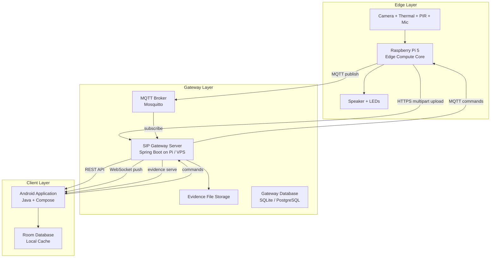

### Key Architectural Decisions

| Decision | Choice | Rationale |
|---|---|---|
| **Real-time delivery** | REST + WebSocket hybrid | REST for CRUD/queries; WebSocket for live incident push and node heartbeats. SSE rejected — WebSocket gives bidirectional control (commands back to Pi). |
| **Backend gateway** | Lightweight Spring Boot (Java) | Bridges MQTT ↔ REST/WebSocket. Runs on Pi itself or a lightweight VPS. Java aligns with career roadmap. |
| **MQTT role** | Pi ↔ Gateway only | Android never speaks MQTT directly. Gateway translates MQTT events into WebSocket messages. Simplifies Android, avoids MQTT library on mobile. |
| **Evidence delivery** | Reference-based | Pi uploads evidence to the gateway using authenticated multipart HTTP. Incident JSON contains evidence references/URLs; Android fetches media on demand via authenticated GET. Never inline binary in MQTT or incident JSON. |
| **Local persistence** | Room (SQLite) | Caches incidents, nodes, policies locally. Enables offline viewing. |
| **Language split** | Java (domain/data/logic) + Kotlin (Compose UI) | Per explicit requirement. Clean interop at ViewModel boundary. |

---

## 2. System Architecture Diagram

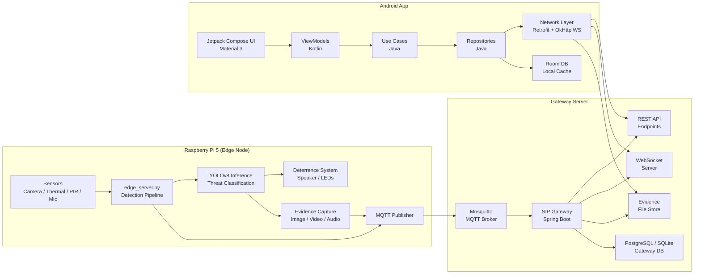

---

## 3. Android Architecture Diagram

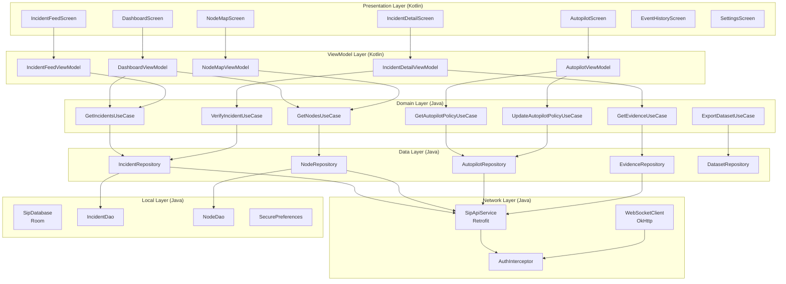

---

## 4. Backend Architecture

### Gateway Server (Spring Boot)

The gateway bridges the MQTT-based Pi network with the Android REST/WebSocket interface. For the prototype it may run **on the Raspberry Pi itself** if resource usage remains acceptable; for multi-node/production deployment it should move to a separate lightweight server/VPS. The gateway is an operational service, not the model-training environment.

#### Runtime Resource Rule

The gateway may run on the Raspberry Pi for the prototype, but the Pi's **real-time inference, evidence capture and deterrence workloads have priority**. The gateway must remain lightweight and bounded. Model training/evaluation is an external workload and must not run concurrently with live inference on the Pi.

#### Core Responsibilities

| Component | Responsibility |
|---|---|
| **MqttSubscriber** | Subscribes to Pi MQTT topics (`sip/incident/*`, `sip/node/+/heartbeat`, `sip/node/+/status`) |
| **IncidentService** | Processes incoming incidents, persists to DB, notifies WebSocket clients |
| **NodeService** | Tracks node state from heartbeats, detects offline nodes |
| **AutopilotService** | Stores/serves autopilot policies, publishes policy updates via MQTT |
| **EvidenceService** | Serves evidence files via authenticated URLs |
| **AuthService** | JWT-based authentication for REST and WebSocket |
| **WebSocketBroadcaster** | Pushes real-time events to connected Android clients |

#### MQTT Topics (Pi → Gateway)

| Topic | Payload | Trigger |
|---|---|---|
| `sip/incident/new` | Full incident JSON | New threat detected |
| `sip/incident/{id}/update` | State change JSON | Deterrence result, escalation |
| `sip/node/{nodeId}/heartbeat` | Heartbeat JSON (status, metrics) | Every 30s from each Pi |
| `sip/node/{nodeId}/status` | Status change JSON | Node degraded/offline |
| `sip/evidence/{incidentId}` | Evidence metadata (file paths) | Evidence captured |

#### MQTT Topics (Gateway → Pi)

| Topic | Payload | Trigger |
|---|---|---|
| `sip/command/{nodeId}/verify` | `{incidentId, verdict}` | Human verification |
| `sip/command/{nodeId}/deterrence` | `{incidentId, action}` | Manual deterrence trigger |
| `sip/command/{nodeId}/policy` | AutopilotPolicy JSON | Policy update |

---

## 5. Raspberry Pi ↔ Backend ↔ Android Data Flow

### Incident Creation Flow

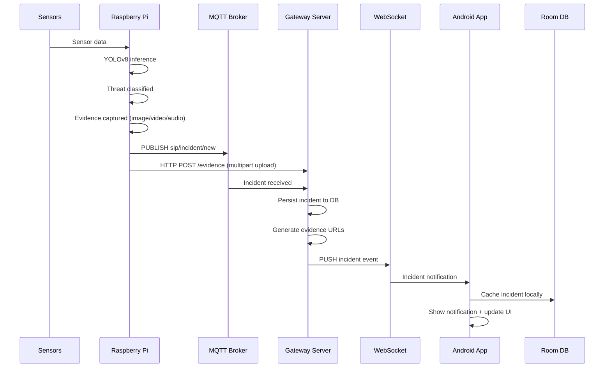

### Evidence Retrieval Flow

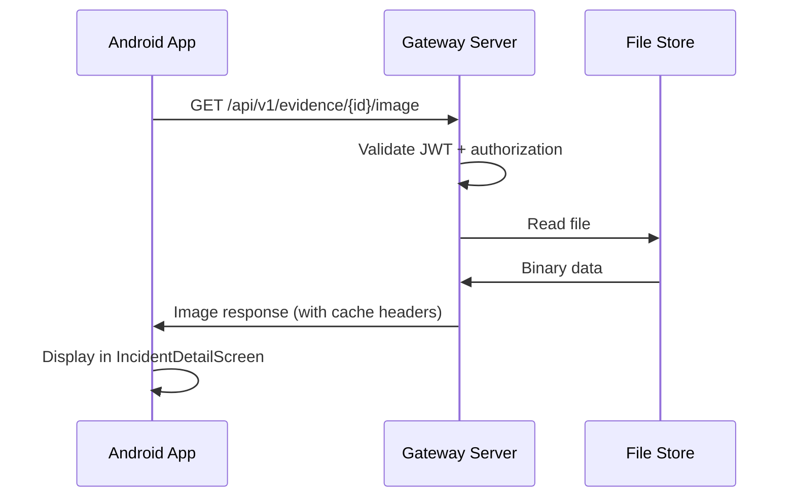

---

## 6. Manual Verification Sequence

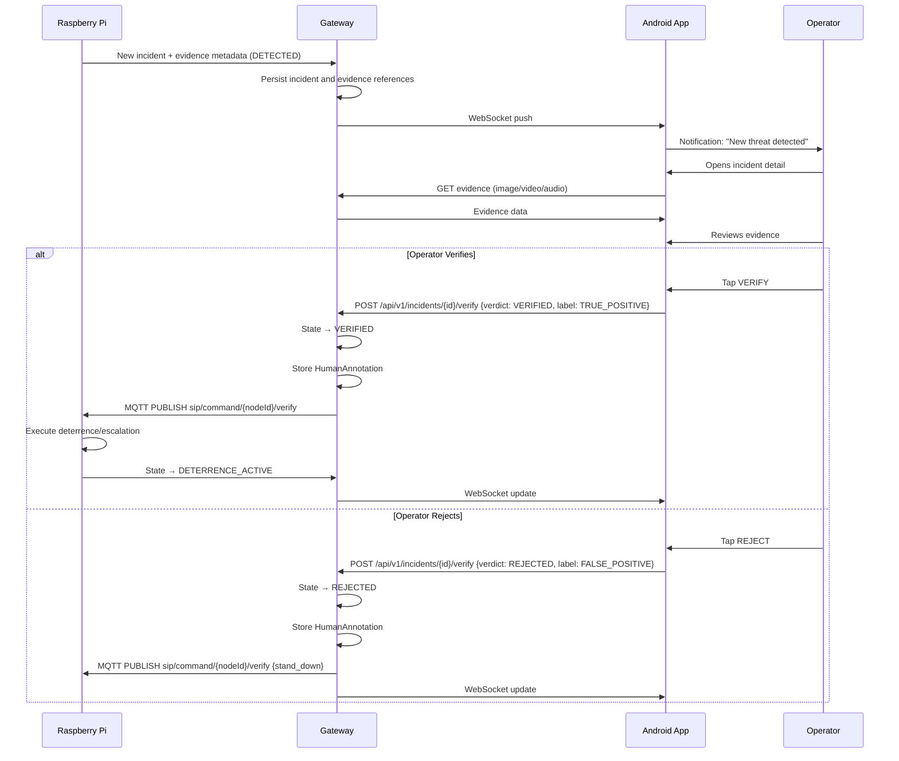

---

## 7. Autopilot Sequence

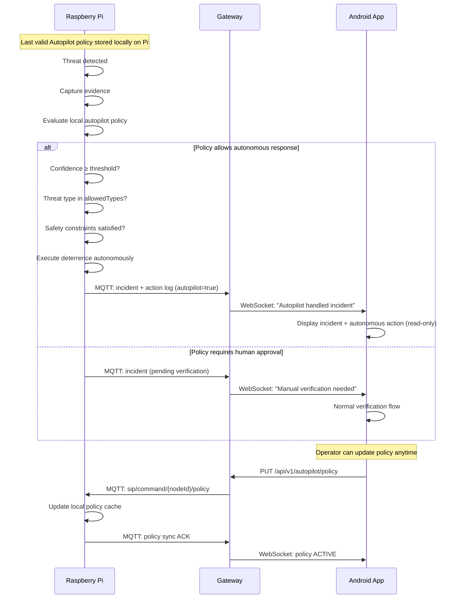

---

## 8. Training-Data Lifecycle

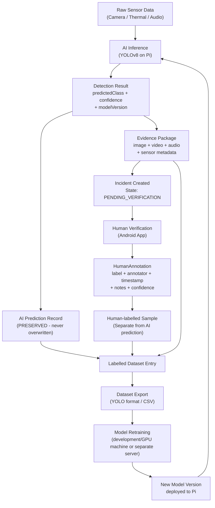

### Data Preservation Rules

1. **AI prediction** (`DetectionResult`): `predictedClass`, `confidence`, `modelVersion` — **NEVER overwritten**
2. **Human annotation** (`HumanAnnotation`): `label`, `annotatorId`, `timestamp`, `notes` — stored as a **separate entity**
3. **Human-labelled sample ≠ automatic ground truth**: labels may be promoted to curated ground truth only after optional quality/adjudication review
4. **Multiple annotations** supported: different operators can annotate the same incident
5. **Disagreement tracking**: if `aiPrediction != humanLabel`, flagged for review
6. **Dataset provenance** preserved: incident ID, evidence references, model version, annotation version and dataset/export version
7. **Export formats**: JSON plus images/labels organized for YOLO and/or COCO conventions as needed

---

## 9. Complete Android Package Structure

```text
com.sip.guardian/
├── SipApplication.java                    # Application class, DI initialization
│
├── di/                                     # Dependency Injection (Hilt)
│   ├── AppModule.java                     # Singleton providers (DB, API, MQTT)
│   ├── NetworkModule.java                 # Retrofit, OkHttp, WebSocket
│   └── RepositoryModule.java             # Repository bindings
│
├── domain/                                # Domain Layer (Pure Java)
│   ├── model/                            # Domain entities
│   │   ├── Incident.java
│   │   ├── Threat.java
│   │   ├── ThreatType.java               # Enum: WEAPON, LOITERING, WILDLIFE, etc.
│   │   ├── ThreatSeverity.java           # Enum: DETERRABLE, NON_DETERRABLE
│   │   ├── Evidence.java
│   │   ├── EvidenceBundle.java
│   │   ├── EvidenceType.java             # Enum: IMAGE, VIDEO, AUDIO
│   │   ├── Location.java
│   │   ├── DetectionResult.java
│   │   ├── HumanAnnotation.java
│   │   ├── HumanLabel.java               # Enum: TRUE_POSITIVE, FALSE_POSITIVE, UNCERTAIN
│   │   ├── Node.java
│   │   ├── NodeStatus.java               # Enum: ONLINE, DEGRADED, OFFLINE, UNKNOWN
│   │   ├── AutopilotPolicy.java
│   │   ├── AutopilotState.java           # Enum: DISABLED, ENABLED, SYNC_PENDING, ACTIVE, ERROR
│   │   ├── DeterrenceAction.java
│   │   ├── DeterrenceType.java           # Enum: AUDIO, VISUAL, COMBINED
│   │   ├── ResponseEvent.java
│   │   ├── AuditEvent.java
│   │   ├── ModelVersion.java
│   │   ├── IncidentState.java            # Enum including AUTONOMOUS_EVALUATION path
│   │   └── User.java
│   │
│   ├── repository/                       # Repository interfaces (Java)
│   │   ├── IncidentRepository.java
│   │   ├── NodeRepository.java
│   │   ├── AutopilotRepository.java
│   │   ├── EvidenceRepository.java
│   │   ├── AuthRepository.java
│   │   └── DatasetRepository.java
│   │
│   └── usecase/                          # Use cases (Java)
│       ├── GetIncidentsUseCase.java
│       ├── GetIncidentDetailUseCase.java
│       ├── VerifyIncidentUseCase.java
│       ├── RejectIncidentUseCase.java
│       ├── GetNodesUseCase.java
│       ├── GetAutopilotPolicyUseCase.java
│       ├── UpdateAutopilotPolicyUseCase.java
│       ├── GetEvidenceUseCase.java
│       ├── ExportDatasetUseCase.java
│       ├── LoginUseCase.java
│       └── GetDashboardUseCase.java
│
├── data/                                  # Data Layer (Java)
│   ├── remote/                           # Network implementations
│   │   ├── api/
│   │   │   ├── SipApiService.java        # Retrofit interface
│   │   │   ├── AuthApiService.java       # Login/refresh endpoints
│   │   │   └── dto/                      # Data Transfer Objects
│   │   │       ├── IncidentDto.java
│   │   │       ├── NodeDto.java
│   │   │       ├── AutopilotPolicyDto.java
│   │   │       ├── VerificationRequest.java
│   │   │       ├── LoginRequest.java
│   │   │       ├── LoginResponse.java
│   │   │       └── DashboardDto.java
│   │   │
│   │   ├── websocket/
│   │   │   ├── SipWebSocketClient.java   # OkHttp WebSocket
│   │   │   ├── WebSocketEvent.java       # Sealed interface for events
│   │   │   └── WebSocketMessageParser.java
│   │   │
│   │   └── interceptor/
│   │       ├── AuthInterceptor.java      # JWT injection
│   │       └── TokenRefreshAuthenticator.java
│   │
│   ├── local/                            # Room database
│   │   ├── SipDatabase.java
│   │   ├── dao/
│   │   │   ├── IncidentDao.java
│   │   │   ├── NodeDao.java
│   │   │   └── AuditEventDao.java
│   │   ├── entity/
│   │   │   ├── IncidentEntity.java
│   │   │   ├── NodeEntity.java
│   │   │   └── AuditEventEntity.java
│   │   └── converter/
│   │       ├── DateConverter.java
│   │       └── ListConverter.java
│   │
│   ├── mapper/                           # Entity ↔ Domain mappers
│   │   ├── IncidentMapper.java
│   │   ├── NodeMapper.java
│   │   └── AutopilotMapper.java
│   │
│   └── repository/                       # Repository implementations
│       ├── IncidentRepositoryImpl.java
│       ├── NodeRepositoryImpl.java
│       ├── AutopilotRepositoryImpl.java
│       ├── EvidenceRepositoryImpl.java
│       ├── AuthRepositoryImpl.java
│       └── DatasetRepositoryImpl.java
│
├── service/                               # Background services (Java)
│   ├── WebSocketService.java             # Active-session WebSocket lifecycle where appropriate
│   ├── NotificationService.java          # Push/local notification handling
│   └── EvidenceCacheService.java         # Background evidence pre-fetch
│
└── ui/                                    # Presentation Layer (Kotlin)
    ├── theme/
    │   ├── Color.kt
    │   ├── Theme.kt
    │   ├── Type.kt
    │   └── Shape.kt
    │
    ├── navigation/
    │   ├── SipNavGraph.kt
    │   └── SipNavDestination.kt
    │
    ├── components/                       # Reusable Compose components
    │   ├── IncidentCard.kt
    │   ├── NodeStatusIndicator.kt
    │   ├── ThreatBadge.kt
    │   ├── ConfidenceMeter.kt
    │   ├── EvidenceViewer.kt
    │   ├── VideoPlayer.kt
    │   ├── AudioPlayer.kt
    │   ├── EventTimeline.kt
    │   ├── StatusSwitch.kt
    │   └── SipTopBar.kt
    │
    ├── screen/
    │   ├── dashboard/
    │   │   ├── DashboardScreen.kt
    │   │   └── DashboardViewModel.kt
    │   ├── incidents/
    │   │   ├── IncidentFeedScreen.kt
    │   │   ├── IncidentFeedViewModel.kt
    │   │   ├── IncidentDetailScreen.kt
    │   │   └── IncidentDetailViewModel.kt
    │   ├── nodes/
    │   │   ├── NodeMapScreen.kt
    │   │   └── NodeMapViewModel.kt
    │   ├── autopilot/
    │   │   ├── AutopilotScreen.kt
    │   │   └── AutopilotViewModel.kt
    │   ├── history/
    │   │   ├── EventHistoryScreen.kt
    │   │   └── EventHistoryViewModel.kt
    │   ├── settings/
    │   │   ├── SettingsScreen.kt
    │   │   └── SettingsViewModel.kt
    │   └── auth/
    │       ├── LoginScreen.kt
    │       └── LoginViewModel.kt
    │
    └── MainActivity.kt
```

---

## 10. Major Java Classes

### Incident.java
- **Responsibility**: Core domain entity representing a detected threat event
- **Attributes**: `id`, `threat`, `location`, `evidenceBundle`, `detectionResult`, `humanAnnotation`, `responseEvents`, `state`, `nodeId`, `timestamp`, `autopilotHandled`
- **Relationships**: Composes `Threat`, `Location`, `EvidenceBundle`, `DetectionResult`, `HumanAnnotation`, `List<ResponseEvent>`
- **OOP**: Encapsulation (immutable fields via constructor), Composition (complex object built from sub-objects)

### Threat.java
- **Responsibility**: Classifies the nature and severity of a detected threat
- **Attributes**: `type` (ThreatType enum), `severity` (ThreatSeverity enum), `description`
- **OOP**: Abstraction (hides classification complexity behind clean type/severity)

### DetectionResult.java
- **Responsibility**: Preserves the original AI prediction — **never modified after creation**
- **Attributes**: `predictedClass`, `confidence`, `modelVersion`, `detectionTimestamp`, `sensorModalities`, `rawScores`
- **OOP**: Immutability (all fields final), Single Responsibility (only AI output)

### HumanAnnotation.java
- **Responsibility**: Records human operator's assessment — separate from AI prediction
- **Attributes**: `label` (HumanLabel enum), `annotatorId`, `timestamp`, `notes`, `confidence`, `version`
- **OOP**: Separation of concerns (human vs AI labels never conflated)

### EvidenceBundle.java
- **Responsibility**: Groups all evidence for an incident
- **Attributes**: `imageUrl`, `videoUrl`, `audioUrl`, `thumbnailUrl`, `captureTimestamp`, `retentionExpiry`
- **Methods**: `hasImage()`, `hasVideo()`, `hasAudio()`, `getAvailableTypes()`
- **OOP**: Encapsulation (URL construction hidden), Composition

### AutopilotPolicy.java
- **Responsibility**: Defines the autonomous operation policy for a node
- **Attributes**: `enabled`, `allowedThreatTypes` (Set<ThreatType>), `confidenceThreshold`, `deterrenceTimeoutSeconds`, `escalationRules`, `safetyConstraints`, `syncState` (AutopilotState enum), `lastSyncTimestamp`
- **Methods**: `isAuthorizedFor(Threat)`, `meetsConfidenceThreshold(double)`, `toJson()`
- **OOP**: Polymorphism (different policies for different nodes), Abstraction

### Node.java
- **Responsibility**: Represents a Raspberry Pi edge node in the mesh
- **Attributes**: `nodeId`, `name`, `location`, `status` (NodeStatus enum), `lastHeartbeat`, `batteryLevel`, `connectivity`, `currentThreatState`, `firmwareVersion`, `autopilotPolicy`
- **Methods**: `isOnline()`, `isStale(Duration)`, `getTimeSinceHeartbeat()`
- **OOP**: Encapsulation, composition with AutopilotPolicy

### IncidentRepository.java (Interface)
- **Responsibility**: Defines contract for incident data access
- **Methods**: `getIncidents(filters)`, `getIncidentById(id)`, `verifyIncident(id, annotation)`, `rejectIncident(id, annotation)`, `observeIncidents()`, `observeIncidentById(id)`
- **OOP**: Dependency Inversion (domain depends on interface, not implementation), Interface Segregation

### IncidentRepositoryImpl.java
- **Responsibility**: Implements IncidentRepository using remote API + local cache
- **Attributes**: `apiService`, `incidentDao`, `webSocketClient`, `incidentMapper`
- **Strategy**: Network-first with local fallback. WebSocket for real-time updates. Room for offline cache.
- **OOP**: Implements `IncidentRepository`, Composition (delegates to API + DAO), Single Responsibility

### VerifyIncidentUseCase.java
- **Responsibility**: Business logic for verifying an incident (creates annotation, transitions state)
- **Attributes**: `incidentRepository`
- **Methods**: `execute(incidentId, HumanLabel, notes, annotatorId)` → `Result<Incident>`
- **Validates**: incident exists, incident is in PENDING_VERIFICATION state, annotator is authorized
- **OOP**: Single Responsibility, Dependency Inversion (injected repository)

### SipWebSocketClient.java
- **Responsibility**: Manages persistent WebSocket connection to gateway
- **Attributes**: `okHttpClient`, `webSocket`, `eventListeners`, `reconnectHandler`, `authToken`
- **Methods**: `connect()`, `disconnect()`, `send(command)`, `addListener(listener)`, `removeListener(listener)`
- **Events emitted**: `OnIncidentReceived`, `OnNodeStatusChanged`, `OnPolicySynced`, `OnConnectionStateChanged`
- **Reconnection**: Exponential backoff (1s → 2s → 4s → ... → 30s max), auto-reconnect on disconnect
- **OOP**: Observer pattern (listeners), Encapsulation (connection management hidden)

### AuthInterceptor.java
- **Responsibility**: Injects JWT bearer token into all API requests
- **Attributes**: `tokenManager`
- **OOP**: Decorator pattern (OkHttp Interceptor)

---

## 11. Kotlin/Compose Classes

All Compose UI code is in Kotlin. These classes interact with Java domain through ViewModels.

| Class | Package | Responsibility |
|---|---|---|
| `DashboardScreen.kt` | `ui.screen.dashboard` | System overview with status cards, node count, active threats, recent incidents |
| `DashboardViewModel.kt` | `ui.screen.dashboard` | Combines dashboard data from multiple use cases |
| `IncidentFeedScreen.kt` | `ui.screen.incidents` | Scrollable chronological incident list with filters |
| `IncidentFeedViewModel.kt` | `ui.screen.incidents` | Manages incident list state, filtering, pagination |
| `IncidentDetailScreen.kt` | `ui.screen.incidents` | Full incident view with evidence, VERIFY/REJECT actions |
| `IncidentDetailViewModel.kt` | `ui.screen.incidents` | Manages detail state, verification actions |
| `NodeMapScreen.kt` | `ui.screen.nodes` | Node grid/list with status indicators |
| `AutopilotScreen.kt` | `ui.screen.autopilot` | Policy configuration UI with switches, sliders, checkboxes |
| `EventHistoryScreen.kt` | `ui.screen.history` | Chronological audit log viewer |
| `LoginScreen.kt` | `ui.screen.auth` | Authentication screen |
| `IncidentCard.kt` | `ui.components` | Reusable card showing incident summary |
| `EvidenceViewer.kt` | `ui.components` | Image/video/audio playback component |
| `EventTimeline.kt` | `ui.components` | Visual timeline of incident events |
| `ThreatBadge.kt` | `ui.components` | Color-coded threat type/severity badge |
| `ConfidenceMeter.kt` | `ui.components` | Visual confidence score indicator |
| `Theme.kt` | `ui.theme` | Material 3 dark/light theme with SIP color palette |

**Why Kotlin**: Jetpack Compose is a Kotlin-first framework. Compose functions (`@Composable`) cannot be written in Java. ViewModels are in Kotlin because they directly interface with Compose state (`StateFlow`, `MutableState`). All business logic below ViewModels is Java.

---

## 12. Domain Model / ER-Style Diagram

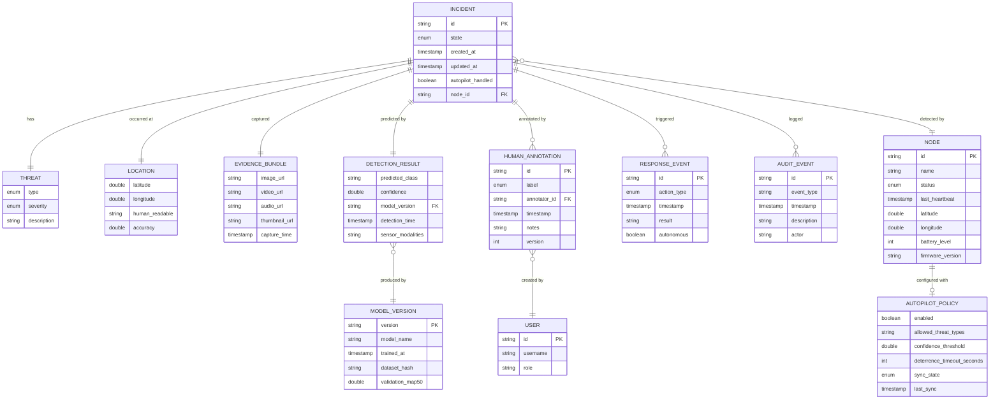

---

## 13. API Specification

### Authentication

| Method | Endpoint | Body | Response | Auth |
|---|---|---|---|---|
| POST | `/api/v1/auth/login` | `{username, password}` | `{token, refreshToken, expiresIn}` | None |
| POST | `/api/v1/auth/refresh` | `{refreshToken}` | `{token, refreshToken, expiresIn}` | None |

### Incidents

| Method | Endpoint | Body | Response | Auth |
|---|---|---|---|---|
| GET | `/api/v1/incidents` | Query: `?page=&size=&state=&threatType=&nodeId=&from=&to=` | `Page<IncidentDto>` | Bearer JWT |
| GET | `/api/v1/incidents/{id}` | — | `IncidentDto` | Bearer JWT |
| POST | `/api/v1/incidents/{id}/verify` | `{verdict: VERIFIED/REJECTED, label, notes}` | `IncidentDto` | Bearer JWT |
| GET | `/api/v1/incidents/{id}/events` | — | `List<AuditEventDto>` | Bearer JWT |

### Evidence

The gateway exposes an authenticated multipart upload endpoint for the Raspberry Pi and authenticated read endpoints for Android. The Pi is an **HTTP client uploading evidence**; it does not host the gateway upload API.

| Method | Endpoint | Body | Response | Auth |
|---|---|---|---|---|
| GET | `/api/v1/evidence/{incidentId}/image` | — | Binary (image/jpeg) | Bearer JWT |
| GET | `/api/v1/evidence/{incidentId}/video` | — | Binary (video/mp4), supports Range | Bearer JWT |
| GET | `/api/v1/evidence/{incidentId}/audio` | — | Binary (audio/wav) | Bearer JWT |
| GET | `/api/v1/evidence/{incidentId}/thumbnail` | — | Binary (image/jpeg, 200px) | Bearer JWT |

### Nodes

| Method | Endpoint | Body | Response | Auth |
|---|---|---|---|---|
| GET | `/api/v1/nodes` | — | `List<NodeDto>` | Bearer JWT |
| GET | `/api/v1/nodes/{id}` | — | `NodeDto` | Bearer JWT |

### Autopilot

| Method | Endpoint | Body | Response | Auth |
|---|---|---|---|---|
| GET | `/api/v1/autopilot/policy` | Query: `?nodeId=` | `AutopilotPolicyDto` | Bearer JWT |
| PUT | `/api/v1/autopilot/policy` | `AutopilotPolicyDto` | `AutopilotPolicyDto` | Bearer JWT |

### Dashboard

| Method | Endpoint | Body | Response | Auth |
|---|---|---|---|---|
| GET | `/api/v1/dashboard` | — | `{totalNodes, onlineNodes, activeThreats, recentIncidents, systemHealth}` | Bearer JWT |

### Dataset Export

| Method | Endpoint | Body | Response | Auth |
|---|---|---|---|---|
| GET | `/api/v1/dataset/export` | Query: `?format=yolo&from=&to=&labels=` | ZIP file (images + labels) | Bearer JWT |
| GET | `/api/v1/dataset/stats` | — | `{totalLabeled, truePositives, falsePositives, byThreatType, byModel}` | Bearer JWT |

---

## 14. WebSocket/Event Specification

### Authentication Note

Do not default to putting bearer access tokens in WebSocket URLs (for example `?token=...`). Evaluate authenticated handshake headers or an equivalent secure mechanism that avoids exposing tokens through URL logging and diagnostics. The selected approach must be documented in the implementation.

### Connection

```text
wss://{host}:{port}/ws/events
```

Authenticate the WebSocket using the selected secure handshake/header/subprotocol mechanism. Do not embed bearer tokens directly in the URL. Use WSS in non-local deployments.

### Message Format (Server → Client)

```json
{
  "type": "INCIDENT_NEW | INCIDENT_UPDATED | NODE_STATUS | POLICY_SYNCED | SYSTEM_ALERT",
  "timestamp": "2026-09-24T00:14:37Z",
  "payload": { ... }
}
```

### Event Types

| Type | Payload | When |
|---|---|---|
| `INCIDENT_NEW` | Full `IncidentDto` | New threat detected |
| `INCIDENT_UPDATED` | `{incidentId, state, responseEvent}` | State transition |
| `NODE_STATUS` | `{nodeId, status, lastHeartbeat, metrics}` | Heartbeat or status change |
| `POLICY_SYNCED` | `{nodeId, syncState, timestamp}` | Policy sync confirmed |
| `SYSTEM_ALERT` | `{level, message, nodeId}` | Node offline, mesh expansion, etc. |

### Message Format (Client → Server)

```json
{
  "type": "SUBSCRIBE | UNSUBSCRIBE | PING",
  "payload": { "channels": ["incidents", "nodes", "all"] }
}
```

---

## 15. MQTT Integration Plan

### Broker

**Mosquitto** running on the gateway host (Pi or VPS). Configuration:

```text
listener 1883
allow_anonymous false
password_file /etc/mosquitto/passwd
```

### Topic Hierarchy

```text
sip/
├── incident/
│   ├── new                          # Pi → GW: new incident
│   └── {incidentId}/
│       └── update                   # Pi → GW: state change
├── node/
│   └── {nodeId}/
│       ├── heartbeat                # Pi → GW: every 30s
│       ├── status                   # Pi → GW: status change
│       └── metrics                  # Pi → GW: system metrics
├── evidence/
│   └── {incidentId}                 # Pi → GW: evidence metadata
├── command/
│   └── {nodeId}/
│       ├── verify                   # GW → Pi: verification result
│       ├── deterrence               # GW → Pi: deterrence command
│       └── policy                   # GW → Pi: policy update
└── mesh/
    ├── topology                     # Node → GW: mesh topology updates
    └── expansion                    # Node → GW: coverage expansion events
```

### QoS Levels

| Topic Pattern | QoS | Rationale |
|---|---|---|
| `sip/incident/*` | 1 (at least once) | Must not lose incidents |
| `sip/command/*` | 1 (at least once) | Commands must be delivered |
| `sip/node/+/heartbeat` | 0 (at most once) | Heartbeats are periodic; missing one is acceptable |
| `sip/evidence/*` | 1 | Evidence metadata must not be lost |

### Pi-Side MQTT Implementation

The Pi's `edge_server.py` will be extended with a lightweight MQTT publisher (using `paho-mqtt`). This is a **minimal addition** to the existing Pi codebase — NOT a rewrite.

---

## 16. Evidence Storage Architecture

```text
Evidence Storage (on Gateway host)
├── evidence/
│   ├── {incidentId}/
│   │   ├── capture.jpg              # Primary detection frame
│   │   ├── thumbnail.jpg            # 200px thumbnail
│   │   ├── clip.mp4                 # 10-second video clip
│   │   └── audio.wav                # Audio capture
│   └── ...
```

### Storage Strategy

| Aspect | Design |
|---|---|
| **Upload** | Pi uploads evidence via HTTP multipart POST to gateway |
| **Serving** | Gateway serves files via authenticated GET endpoints |
| **Thumbnails** | Generated server-side on upload (200px width) |
| **Caching** | Android uses Coil image loader with disk cache (50MB) |
| **Retention** | Configurable per-incident retention period (default 30 days) |
| **Video streaming** | HTTP Range requests supported for video playback |
| **Compression** | JPEG quality 85 for images; H.264 for video |

---

## 17. Database Schema

### Gateway Database (PostgreSQL / SQLite)

```sql
CREATE TABLE incidents (
    id TEXT PRIMARY KEY,
    state TEXT NOT NULL,                      -- IncidentState enum
    threat_type TEXT NOT NULL,                -- ThreatType enum  
    threat_severity TEXT NOT NULL,            -- ThreatSeverity enum
    threat_description TEXT,
    latitude REAL,
    longitude REAL,
    location_readable TEXT,
    node_id TEXT NOT NULL REFERENCES nodes(id),
    autopilot_handled BOOLEAN DEFAULT FALSE,
    created_at TIMESTAMP NOT NULL,
    updated_at TIMESTAMP NOT NULL
);

CREATE TABLE detection_results (
    id TEXT PRIMARY KEY,
    incident_id TEXT NOT NULL REFERENCES incidents(id),
    predicted_class TEXT NOT NULL,
    confidence REAL NOT NULL,
    model_version TEXT NOT NULL,
    detection_timestamp TIMESTAMP NOT NULL,
    sensor_modalities TEXT,                   -- JSON array
    raw_scores TEXT                           -- JSON object
);

CREATE TABLE evidence_bundles (
    incident_id TEXT PRIMARY KEY REFERENCES incidents(id),
    image_path TEXT,
    video_path TEXT,
    audio_path TEXT,
    thumbnail_path TEXT,
    capture_timestamp TIMESTAMP
);

CREATE TABLE human_annotations (
    id TEXT PRIMARY KEY,
    incident_id TEXT NOT NULL REFERENCES incidents(id),
    label TEXT NOT NULL,                      -- HumanLabel enum
    annotator_id TEXT NOT NULL REFERENCES users(id),
    timestamp TIMESTAMP NOT NULL,
    notes TEXT,
    version INTEGER DEFAULT 1
);

CREATE TABLE nodes (
    id TEXT PRIMARY KEY,
    name TEXT NOT NULL,
    status TEXT NOT NULL DEFAULT 'UNKNOWN',
    latitude REAL,
    longitude REAL,
    last_heartbeat TIMESTAMP,
    battery_level INTEGER,
    firmware_version TEXT
);

CREATE TABLE autopilot_policies (
    node_id TEXT PRIMARY KEY REFERENCES nodes(id),
    enabled BOOLEAN DEFAULT FALSE,
    allowed_threat_types TEXT,                -- JSON array
    confidence_threshold REAL DEFAULT 0.85,
    deterrence_timeout_seconds INTEGER DEFAULT 5,
    sync_state TEXT DEFAULT 'DISABLED',
    last_sync TIMESTAMP
);

CREATE TABLE response_events (
    id TEXT PRIMARY KEY,
    incident_id TEXT NOT NULL REFERENCES incidents(id),
    action_type TEXT NOT NULL,
    timestamp TIMESTAMP NOT NULL,
    result TEXT,
    autonomous BOOLEAN DEFAULT FALSE
);

CREATE TABLE audit_events (
    id TEXT PRIMARY KEY,
    incident_id TEXT REFERENCES incidents(id),
    event_type TEXT NOT NULL,
    timestamp TIMESTAMP NOT NULL,
    description TEXT,
    actor TEXT
);

CREATE TABLE model_versions (
    version TEXT PRIMARY KEY,
    model_name TEXT NOT NULL,
    trained_at TIMESTAMP,
    dataset_hash TEXT,
    validation_map50 REAL
);

CREATE TABLE users (
    id TEXT PRIMARY KEY,
    username TEXT UNIQUE NOT NULL,
    password_hash TEXT NOT NULL,
    role TEXT NOT NULL DEFAULT 'OPERATOR'
);
```

### Android Room Database (Local Cache)

Mirrors a subset of the gateway schema for offline access. Key tables: `incidents`, `nodes`, `audit_events`. Evidence is cached via Coil disk cache, not Room.

---

## 18. Autopilot Policy Model

```java
public class AutopilotPolicy {
    private boolean enabled;
    private Set<ThreatType> allowedThreatTypes;
    private double confidenceThreshold;         // 0.0 - 1.0
    private int deterrenceTimeoutSeconds;       // How long to attempt deterrence
    private EscalationRules escalationRules;
    private SafetyConstraints safetyConstraints;
    private AutopilotState syncState;
    private Instant lastSyncTimestamp;
    
    /** Check if this policy authorizes autonomous response for a threat */
    public boolean isAuthorizedFor(Threat threat, double confidence) {
        return enabled
            && allowedThreatTypes.contains(threat.getType())
            && confidence >= confidenceThreshold
            && safetyConstraints.isSatisfied(threat);
    }
}

public class EscalationRules {
    private boolean autoEscalateOnDeterrenceFailure;  // true = escalate if deterrence fails
    private int maxDeterrenceAttempts;                 // before forced escalation
    private Set<ThreatType> alwaysEscalateTypes;       // always go to Tier 2
}

public class SafetyConstraints {
    private boolean requireMinimumConfidence;
    private boolean requireMultiModalConfirmation;     // require 2+ sensor modalities
    private Set<ThreatType> neverAutonomousTypes;      // WEAPON, ASSAULT → always human
}
```

### Policy Sync Flow

```text
1. Operator configures policy in Android UI
2. App sends PUT /api/v1/autopilot/policy
3. Gateway stores policy in DB
4. Gateway publishes to MQTT: sip/command/{nodeId}/policy
5. Pi receives policy, stores locally in JSON file
6. Pi ACKs via MQTT: sip/node/{nodeId}/status {policySynced: true}
7. Gateway updates syncState → ACTIVE
8. Gateway pushes WebSocket event to App
9. App shows "Policy Active" status
```

---

## 19. Incident State Machine

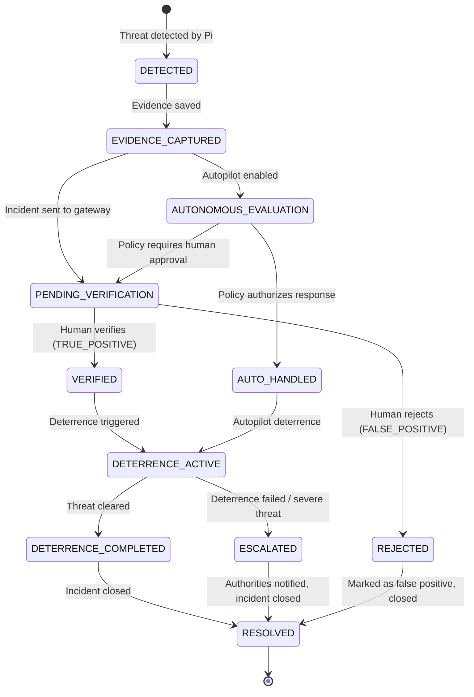

### State Transition Rules

| From | To | Trigger | Who |
|---|---|---|---|
| DETECTED | EVIDENCE_CAPTURED | Evidence files saved | Pi (automatic) |
| EVIDENCE_CAPTURED | PENDING_VERIFICATION | Manual-response workflow selected | Pi / Gateway |
| EVIDENCE_CAPTURED | AUTONOMOUS_EVALUATION | Autopilot is enabled | Pi (automatic) |
| PENDING_VERIFICATION | VERIFIED | Operator taps VERIFY | Human (Android) |
| PENDING_VERIFICATION | REJECTED | Operator taps REJECT | Human (Android) |
| AUTONOMOUS_EVALUATION | AUTO_HANDLED | Local policy authorizes response | Pi (automatic) |
| AUTONOMOUS_EVALUATION | PENDING_VERIFICATION | Policy requires human approval | Pi / Gateway |
| VERIFIED | DETERRENCE_ACTIVE | Deterrence command sent | System |
| AUTO_HANDLED | DETERRENCE_ACTIVE | Autopilot executes | Pi (automatic) |
| DETERRENCE_ACTIVE | DETERRENCE_COMPLETED | Threat no longer present | Pi (automatic) |
| DETERRENCE_ACTIVE | ESCALATED | Timeout / severe threat | Pi / Policy |
| DETERRENCE_COMPLETED | RESOLVED | Incident closes | System |
| ESCALATED | RESOLVED | Authorities notified | System |
| REJECTED | RESOLVED | Closes | System |

---

## 20. Node State Machine

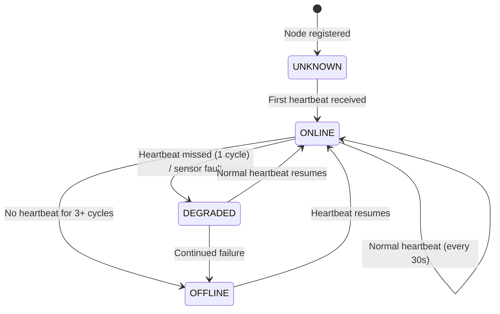

### Heartbeat Logic

- **Heartbeat interval**: 30 seconds
- **DEGRADED**: 1 missed heartbeat (30-90s silence) OR sensor reporting fault
- **OFFLINE**: 3+ missed heartbeats (>90s silence)
- **Mesh response**: When a node goes OFFLINE, adjacent nodes receive `mesh/expansion` event and increase their monitoring sensitivity

---

## 21. UI Screen Map

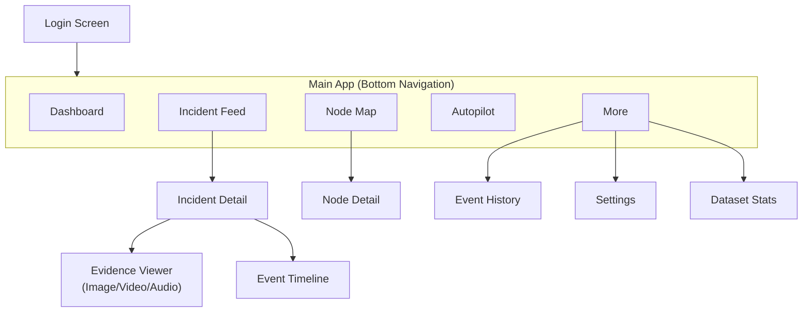

### Screen Details

| Screen | Key Elements |
|---|---|
| **Dashboard** | System status card (GREEN/YELLOW/RED), node count (online/total), active threats count, recent incidents list (5), autopilot status badge, quick-action FABs |
| **Incident Feed** | LazyColumn of IncidentCards, filter chips (severity, type, state, node), pull-to-refresh, real-time WebSocket updates animate in |
| **Incident Detail** | Evidence carousel (image/video/audio), threat info card, AI prediction card, location card, event timeline, VERIFY/REJECT buttons (prominent, bottom-anchored) |
| **Node Map** | Grid of NodeStatusCards with colored indicators (GREEN/ORANGE/RED), last heartbeat, battery, active threat, tap for detail |
| **Autopilot** | Master switch, threat type checkboxes, confidence slider (0-100%), deterrence timeout stepper, safety constraint toggles, sync status indicator |
| **Event History** | Chronological timeline with timestamps, event types, icons, filterable by incident/node |
| **Settings** | Backend URL, notification preferences, evidence cache management, theme toggle, account info, about |

---

## 22. Material 3 Design System

### Color Palette

```kotlin
// SIP Guardian Theme - Security/Operations aesthetic
// Dark theme primary (used by default)
val SipDarkBackground = Color(0xFF0D1117)        // GitHub-dark inspired
val SipDarkSurface = Color(0xFF161B22)
val SipDarkSurfaceVariant = Color(0xFF21262D)
val SipPrimary = Color(0xFF58A6FF)               // Trust blue
val SipSecondary = Color(0xFF3FB950)              // Safe green
val SipTertiary = Color(0xFFD2A8FF)              // Accent purple

// Severity colors
val SipCritical = Color(0xFFF85149)              // Red - severe threats
val SipWarning = Color(0xFFD29922)               // Amber - degraded/warning
val SipSafe = Color(0xFF3FB950)                  // Green - online/safe
val SipInfo = Color(0xFF58A6FF)                  // Blue - informational
val SipMuted = Color(0xFF8B949E)                 // Gray - inactive

// Node status
val NodeOnline = SipSafe
val NodeDegraded = SipWarning
val NodeOffline = SipCritical

// Threat severity
val ThreatLow = Color(0xFF388BFD)
val ThreatMedium = SipWarning
val ThreatHigh = Color(0xFFDA3633)
val ThreatCritical = Color(0xFFF85149)
```

### Typography

```kotlin
// Google Fonts: Inter (primary), JetBrains Mono (data/timestamps)
val SipTypography = Typography(
    headlineLarge = TextStyle(fontFamily = InterFamily, fontWeight = Bold, fontSize = 28.sp),
    titleLarge = TextStyle(fontFamily = InterFamily, fontWeight = SemiBold, fontSize = 20.sp),
    bodyLarge = TextStyle(fontFamily = InterFamily, fontWeight = Normal, fontSize = 16.sp),
    labelSmall = TextStyle(fontFamily = JetBrainsMonoFamily, fontSize = 11.sp)  // timestamps
)
```

### Component Styling

- **Cards**: `RoundedCornerShape(16.dp)`, elevated with subtle shadow
- **Buttons**: Filled (VERIFY = green), Outlined (REJECT = red border)
- **Switches**: Animated Material 3 switches with thumb icons
- **Status indicators**: Animated pulsing dot (12dp) for ONLINE nodes
- **Confidence meter**: Horizontal progress bar with gradient (red → yellow → green)
- **Bottom navigation**: 5 items, icons + labels, animated selection indicator

---

## 23. Repository Reuse Analysis

| Repository | Tech | License | Relevant Content | Reuse Potential | Recommendation |
|---|---|---|---|---|---|
| **AI-Surveillance-System** (bappaditya-paul) | Python, YOLOv8 | **No license** | Human detection, tracking, alerts, structured `src/` with config | Conceptual only — alert structure, detection pipeline patterns | ⚠️ Cannot reuse code (no license). Study architecture for API design inspiration. |
| **ai-video-intelligence-platform** (Amaldaskm7736) | Python (backend), React (frontend), YOLOv8 | **MIT** | Zone intrusion, live dashboard, REST API structure | Backend API patterns, dashboard UI inspiration | ✅ Can study and adapt API patterns under MIT. React dashboard not directly useful (different platform). |
| **ai-security-surveillance** (Fizza-Awan) | Python, Jupyter | **No license** | ML model training notebooks | Minimal — training code, not app code | ⚠️ No license, no app code. Skip. |
| **Weapon-Detection-and-Alarm-System** (K-saif) | Python, Flask, YOLOv8 | **MIT** | Flask web app, weapon detection, alarm system | API endpoint patterns for weapon detection alerts | ✅ Can study alarm API pattern under MIT. Very small codebase. |
| **YoloV4-Weapons-Detection** (MahmoudMTaha) | Python, Jupyter, Darknet | **No license** | YOLOv4 training/deployment notebook | Minimal — training code only | ⚠️ No license. Not relevant to Android app. |
| **Camera-Surveillance-Dashboard** (kgdash116) | React, Node.js, AWS Amplify | **No license** | Cloud dashboard with camera feeds | Dashboard layout patterns | ⚠️ No license, web-only. Study layout concepts only. |
| **Security-Dashboard-** (Te-Stack) | React, TypeScript, Vite | **No license** | Security dashboard UI | Dashboard component patterns | ⚠️ No license, web-only. Study component hierarchy only. |

### Conclusion

None of these repositories are Android applications. **No direct code reuse is possible or advisable.** The primary value is:
1. **API pattern inspiration** from `ai-video-intelligence-platform` (MIT) — incident/alert endpoint structure
2. **Dashboard layout concepts** from the web dashboards — card layouts, status indicators, timeline patterns
3. **Alert data model** from `AI-Surveillance-System` — structured detection + response fields

All actual Android code will be written from scratch, using standard Android/Jetpack libraries.

---

## 24. License Analysis

| Dependency | License | Usage | Concern |
|---|---|---|---|
| Android SDK / Jetpack | Apache 2.0 | Core framework | None |
| Jetpack Compose | Apache 2.0 | UI framework | None |
| Material 3 | Apache 2.0 | Design system | None |
| Room | Apache 2.0 | Local database | None |
| Retrofit | Apache 2.0 | HTTP client | None |
| OkHttp | Apache 2.0 | HTTP + WebSocket | None |
| Gson / Moshi | Apache 2.0 | JSON serialization | None |
| Hilt (Dagger) | Apache 2.0 | Dependency injection | None |
| Coil | Apache 2.0 | Image loading | None |
| ExoPlayer / Media3 | Apache 2.0 | Video/audio playback | None |
| Spring Boot (gateway) | Apache 2.0 | Backend gateway | None |
| Eclipse Paho (Pi) | EPL 2.0 | MQTT client on Pi | EPL requires notice — OK for internal use |
| Mosquitto | EPL 2.0 | MQTT broker | Same — OK for deployment |

**All dependencies are permissively licensed.** No GPL-contamination risk.

---

## 25. Raspberry Pi Development Access

The Raspberry Pi 5 is currently powered on and connected to the same Wi-Fi network as the development machine. Connection details are available in the project's local `.env` file through the variables:

```text
IP_ADDRESS
USERNAME
PASSWORD
```

Use these environment variables only for development/integration access. Never hardcode, print, commit, expose through the Android app, or copy these credentials into generated documentation. Prefer SSH keys for future persistent development access where practical.

Before modifying the Pi:

1. Inspect the current OS and runtime environment.
2. Inspect existing SIP files and running services.
3. Preserve existing work and configuration.
4. Make the smallest integration changes necessary.
5. Avoid destructive operations unless explicitly justified.

The Pi's local autonomy must remain functional even if Android or the gateway becomes temporarily unavailable.

---

## 26. Security Architecture

### Authentication Flow

```text
1. User enters credentials in LoginScreen
2. App sends POST /api/v1/auth/login
3. Gateway validates credentials, returns JWT + refresh token
4. App stores tokens in Android EncryptedSharedPreferences
5. AuthInterceptor injects Bearer token in all subsequent requests
6. WebSocket connection includes token as query parameter
7. Token refresh: App uses refresh token before expiry (background)
```

### Security Measures

| Layer | Measure |
|---|---|
| **Transport** | HTTPS/TLS for all API calls. WSS for WebSocket. |
| **Authentication** | JWT bearer tokens. Short-lived access (15min) + long-lived refresh (7 days). |
| **Token storage** | Android `EncryptedSharedPreferences` (AES-256-SIV + AES-256-GCM) |
| **API authorization** | All endpoints require valid JWT except `/auth/login` |
| **WebSocket auth** | Token validated on connection handshake; connection dropped if invalid |
| **Command authorization** | TRIGGER_DETERRENCE, UPDATE_POLICY require authenticated + authorized user |
| **Evidence URLs** | Served via authenticated API endpoints, not public URLs |
| **Pi credentials** | NEVER stored in Android app. Pi communicates only via MQTT to gateway. |
| **MQTT security** | Username/password auth on Mosquitto. Pi and gateway have separate credentials. |
| **Audit logging** | All verification, deterrence, and policy actions are logged with actor + timestamp |
| **Input validation** | All API inputs validated server-side. Android validates before sending. |

### What is NOT stored in the Android APK

- Raspberry Pi SSH credentials
- MQTT broker credentials
- Database passwords
- Any backend secrets

---

## 27. Testing Strategy

### Unit Tests (Java — JUnit 5 + Mockito)

| Test Suite | What is Tested |
|---|---|
| `IncidentStateTest` | All valid/invalid state transitions |
| `AutopilotPolicyTest` | `isAuthorizedFor()` with various threat/confidence combinations |
| `VerifyIncidentUseCaseTest` | Verification logic, annotation creation, state transitions |
| `IncidentMapperTest` | DTO ↔ Entity ↔ Domain mapping correctness |
| `WebSocketMessageParserTest` | Parsing of all event types, malformed messages |
| `AuthInterceptorTest` | Token injection, refresh trigger |

### Repository Tests (Java — JUnit 5 + MockWebServer)

| Test Suite | What is Tested |
|---|---|
| `IncidentRepositoryImplTest` | Network-first fallback, cache update, error handling |
| `NodeRepositoryImplTest` | Heartbeat staleness calculation, status transitions |
| `AutopilotRepositoryImplTest` | Policy sync lifecycle |

### Integration Tests

| Test | What is Tested |
|---|---|
| API round-trip | Full REST request/response against running gateway |
| WebSocket lifecycle | Connect → receive events → reconnect on disconnect |
| Evidence retrieval | Upload on Pi → serve from gateway → display in app |
| Policy sync | App → gateway → MQTT → Pi → ACK → app |

### UI Tests (Compose — Espresso + Compose Testing)

| Test | What is Tested |
|---|---|
| `IncidentDetailScreenTest` | VERIFY/REJECT buttons visible for PENDING_VERIFICATION state |
| `AutopilotScreenTest` | Toggle switch, slider, checkbox interactions |
| `DashboardScreenTest` | Correct counts displayed |

### Edge Case Tests

The tests must distinguish **foreground real-time behavior** from **background/killed-app notification behavior**. A persistent foreground WebSocket must not be treated as the only mechanism for receiving critical incident notifications.


| Scenario | Expected Behavior |
|---|---|
| Wi-Fi disappears | App shows cached data, WebSocket auto-reconnects, offline banner |
| Pi disappears | Node status → OFFLINE in app, mesh expansion event shown |
| Android backgrounded | Use the platform-appropriate push notification path where required, synchronize missed events through REST when the app resumes, and maintain WebSocket real-time delivery while actively connected. Do not make a permanently running WebSocket the sole notification mechanism. |
| Backend disappears | App shows cached data, retry with exponential backoff |
| Evidence upload fails | Pi retries; incident created with `evidence_pending` flag |
| Duplicate incident | Gateway deduplicates by incident ID |
| Autopilot policy sync fails | Policy stays in SYNC_PENDING, retry on next connection |

---

## 28. Incremental Implementation Roadmap

### Increment 1: Project Shell + Navigation (Week 1)

- Initialize Android project (Gradle, Java 17, Kotlin, Compose)
- Material 3 theme + color palette
- Bottom navigation with 5 destinations
- Empty screens for all 7 destinations
- Login screen (mock)
- **Deliverable**: Navigable app shell with SIP branding

### Increment 2: Domain Models + Local Database (Week 2)

- All Java domain model classes
- Room database + entities + DAOs
- Enums (IncidentState, ThreatType, NodeStatus, etc.)
- State machine validation logic
- Unit tests for models and state transitions
- **Deliverable**: Complete domain layer, tested

### Increment 3: Gateway Server + REST API (Week 3–4)

- Spring Boot gateway project (Java)
- REST endpoints (incidents, nodes, autopilot, evidence, auth)
- PostgreSQL/SQLite schema
- JWT authentication
- Mock data seeding for development
- **Deliverable**: Running gateway with full API, testable via Postman

### Increment 4: Android Network Layer + Data Binding (Week 5)

- Retrofit service interfaces
- OkHttp client with AuthInterceptor
- Repository implementations (network + local cache)
- Use case implementations
- ViewModel integration
- **Deliverable**: App loads data from gateway API

### Increment 5: Dashboard + Incident Feed UI (Week 6)

- DashboardScreen with live stats
- IncidentFeedScreen with IncidentCards
- Pull-to-refresh, pagination
- Filter chips
- **Deliverable**: Browsable incident feed

### Increment 6: Incident Detail + Evidence Viewing (Week 7)

- IncidentDetailScreen
- EvidenceViewer (image display, video playback, audio playback)
- Threat classification display
- Event timeline component
- **Deliverable**: Full incident inspection capability

### Increment 7: Human Verification + Training Data (Week 8)

- VERIFY / REJECT actions
- HumanAnnotation creation
- State transitions on verification
- Annotation history display
- Training data preservation logic
- Dataset stats screen
- **Deliverable**: Complete verification workflow, training data captured

### Increment 8: WebSocket Real-Time Events (Week 9)

- SipWebSocketClient implementation
- WebSocketService (foreground service)
- Real-time incident push
- Real-time node status updates
- Reconnection with exponential backoff
- Android notifications for new incidents
- **Deliverable**: Real-time incident delivery

### Increment 9: Autopilot + Node Management (Week 10)

- AutopilotScreen UI
- Policy configuration (switches, sliders, checkboxes)
- Policy sync via API → MQTT → Pi
- NodeMapScreen
- Node status tracking from heartbeats
- **Deliverable**: Autopilot configuration, node monitoring

### Increment 10: Pi Integration + MQTT Bridge (Week 11–12)

- MQTT publisher module added to Pi's `edge_server.py`
- Gateway MQTT subscriber
- Evidence upload from Pi to gateway
- End-to-end flow: sensor → Pi → MQTT → gateway → WebSocket → Android
- Autopilot policy sync: Android → gateway → MQTT → Pi
- **Deliverable**: Full end-to-end system integration

---

## 29. Deployment Architecture

### Development Environment

```text
Developer Machine (Fedora Linux)
├── Android Studio → SIP Android App
├── IntelliJ / VS Code → SIP Gateway (Spring Boot)
└── SSH → Raspberry Pi

Raspberry Pi 5
├── edge_server.py (detection + response pipeline)
├── mqtt_subscriber.py (gateway command handling)
├── telegram_bot.py (monitoring)
├── mosquitto (MQTT broker, if Pi-hosted gateway mode is used)
└── sip-gateway.jar (Spring Boot gateway, prototype mode)

Development / Training Machine or Future VPS
├── model training / evaluation workloads
├── dataset curation
└── optional production gateway when separated from the Pi

Android Emulator / Physical Device
└── SIP Guardian App
```

### Production Architecture (Future)

```text
Cloud / VPS
├── SIP Gateway (Spring Boot)
├── PostgreSQL
├── Mosquitto (or AWS IoT Core)
└── Evidence Storage (S3 / MinIO)

Raspberry Pi Nodes (n)
├── Each runs edge_server.py + MQTT client
├── Connected via 4G/LTE
└── Mesh network between adjacent nodes

Training workloads remain off-node during live inference/deployment.

Mobile Devices
└── SIP Guardian Android App
```

---

## 30. Raspberry Pi Integration Plan

### Minimal Pi Changes Required

The existing Pi codebase (`edge_server.py`, `train_autonomous.py`, etc.) is **preserved intact**. Integration requires:

1. **Add `paho-mqtt` publisher** to `edge_server.py`:
   - On threat detection → publish to `sip/incident/new`
   - On status change → publish to `sip/incident/{id}/update`
   - Heartbeat every 30s → publish to `sip/node/{nodeId}/heartbeat`

2. **Add `mqtt_subscriber.py`** (new file):
   - Subscribe to `sip/command/{nodeId}/*`
   - Handle verify, deterrence, policy commands
   - Store autopilot policy in local JSON

3. **Add evidence upload client** to the Pi:
   - On detection → save evidence files locally
   - HTTP POST multipart to gateway `/api/v1/evidence/upload`
   - Retry failed uploads with bounded backoff
   - Mark evidence status separately from incident state

4. **Install Mosquitto** on Pi (or gateway host):
   ```bash
   sudo apt install mosquitto mosquitto-clients
   ```

5. **New systemd service** for MQTT subscriber:
   ```bash
   sip-mqtt.service → runs mqtt_subscriber.py
   ```

### What is NOT Changed

- `train_autonomous.py` — untouched by the Android integration; training remains an external workload and must not compete with real-time inference
- `telegram_bot.py` — untouched
- `download_and_merge.py` — untouched
- Training pipeline — untouched
- Wi-Fi configuration — untouched

---

## 31. Risks, Trade-offs and Unresolved Questions

### Risks

| Risk | Severity | Mitigation |
|---|---|---|
| Pi not reachable from dev machine (different network) | Medium | Gateway runs on Pi itself; test on same Wi-Fi. Use Telegram bot as fallback monitoring. |
| 4GB RAM Pi running gateway + detection | Medium | Keep real-time inference and gateway workloads bounded. **Do not run training concurrently with inference.** Move training to a development/GPU machine or separate server. Production: separate gateway host. |
| Android background delivery / battery constraints | Medium | WebSocket while actively connected; platform-appropriate push notifications when backgrounded; REST reconciliation on resume. Do not rely on a permanently running socket. |
| Evidence upload over 4G (large video files) | Medium | Limit clip to 10s. Compress to 720p. Thumbnail-first strategy. Queue and retry. |
| Single point of failure (one gateway) | Low (prototype) | Acceptable for prototype. Production: replicated gateway. |

### Trade-offs

| Decision | Trade-off | Justification |
|---|---|---|
| Gateway on Pi vs cloud | Latency vs availability | Pi-local for prototype (no internet needed). Cloud for production multi-node. |
| Spring Boot vs lightweight (Ktor/Vert.x) | Memory vs ecosystem | Spring Boot uses more RAM but has best Java ecosystem, matches career goals, and has excellent MQTT integration. |
| WebSocket vs SSE | Complexity vs bidirectionality | WebSocket adds complexity but enables sending commands back (verify, deterrence) over the same connection. |
| Room vs no local cache | Disk usage vs offline capability | Room adds ~2MB. Essential for offline viewing and intermittent connectivity. |

### Open Questions for User Review

> [!IMPORTANT]
> **Gateway hosting**: For the current prototype, prefer Pi-hosted gateway if resource measurements remain acceptable; retain a documented migration path to a separate machine/VPS for multi-node deployment.

> [!IMPORTANT]
> **Authentication scope**: Implement a minimal authenticated operator flow for the prototype, but structure the User/authorization model so ADMIN/OPERATOR roles can be added without redesigning the API.

> [!NOTE]
> **Dataset export format**: Support YOLO export first and keep the exporter abstraction extensible so COCO JSON can be added without changing incident/annotation models.

> [!NOTE]
> **Notification method**: Design a notification abstraction so local notifications work during development and a push provider such as FCM can be added for background/killed-app delivery without coupling the core incident architecture to a single provider.

> [!WARNING]
> **Pi TensorFlow environment**: The project context mentions a corrupted TensorFlow installation on the Pi. Verify the current environment before Pi integration and repair it only after inspecting the existing dependency set; do not blindly force-reinstall TensorFlow. This is relevant to the audio pipeline, not to Android architecture itself.
